# Basic CI/CD
## Part 1. Настройка gitlab-runner
### Основы **CI/CD**

**CI/CD** — Это набор принципов и практик, которые позволяют чаще и надежнее развертывать изменения программного обеспечения.

Причины применения **CI/CD**:
- Командная разработка;
- Длинный жизненный цикл ПО;
- Сокращение релизного цикла;
- Сложность развертывания и тестирования крупных систем;
- Человеческий фактор.

**CI/CD** pipeline - Это последовательность действий (скриптов) для определенной версии кода в репозитории, которая запускается автоматически при совершении изменений.

### Основы **CI**

**CI** (Continuous Integration) — в дословном переводе «непрерывная интеграция».
Имеется в виду интеграция отдельных кусочков кода приложения между собой.
**CI** обычно выполняет две задачи, описанные далее.

- BUILD
    - Проверяем, собирается ли вообще код;
    - Готовим артефакты для следующих стадий;

- TEST
    - Тесты кодстайла;
    - Модульные тесты;
    - Интеграционные тесты;
    - Прочие тесты, которые у тебя есть;
    - Отчеты о тестах.

### Основы **CD**

**CD** (Continuous Delivery) — это расширение непрерывной интеграции, поскольку оно автоматически развертывает все изменения кода в тестовой и/или производственной среде после этапа сборки.
**CD** может выполнять задачи, описанные далее.

- PUBLISH (В случае применения докера для развёртывания):
    - Собираем образы контейнеров;
    - Пушим образы туда, откуда их будем потом брать для развертывания;
- UPDATE CONFIGS:
    - Обновляем конфигурацию на машинах;
- DEPLOY STAGING:
    - Развертывание тестовой среды для ручных тестов, QA, и прочих не автоматизируемых проверок;
    - Может запускаться как вручную, так и автоматически при успешном прохождении стадий CI;
- DEPLOY PRODUCTION:
    - Разворачиваем новую версию системы на «продакшн»;
    - Этот этап желательно запускать вручную, а не автоматически;
    - По желанию можно настроить только для определенной ветки репозитория (master, release и т.п.).

**== Задание ==**

##### Поднять виртуальную машину *Ubuntu Server 20.04 LTS*

##### Скачать и установить на виртуальную машину **gitlab-runner**

##### Запустить **gitlab-runner** и зарегистрировать его для использования в текущем проекте (*DO6_CICD*)

**== Решение ==**

1) Устанавливаем gitlab-runner:

    - `curl -L "https://packages.gitlab.com/install/repositories/runner/gitlab-runner/script.deb.sh" | sudo bash`

    - `sudo apt-get install gitlab-runner`

2) Устанавливаем все необходимые пакеты в Ubuntu:

    - `sudo apt install make`

    - `sudo apt install gcc`

    - `sudo apt install clang-format`

3) Регистрируем проект:

    - `sudo gitlab-runner start`

        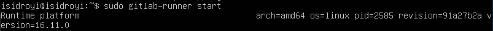

    - `sudo gitlab-runner register`, указываем URL, токен и тэг (url и токен берем на странице проекта на сайте edu.21-school.ru)

        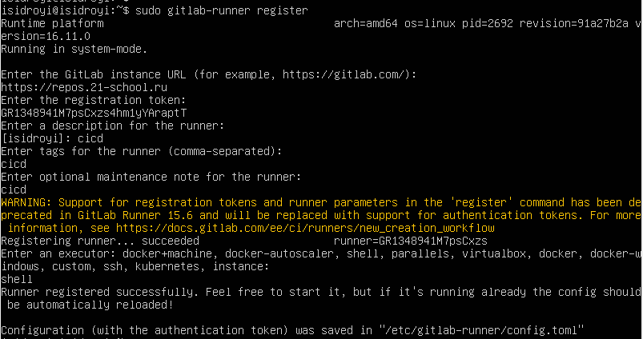

## Part 2. Сборка

**== Задание ==**

#### Написать этап для **CI** по сборке приложений из проекта *C2_SimpleBashUtils*:

##### В файле _gitlab-ci.yml_ добавить этап запуска сборки через мейк файл из проекта _C2_

##### Файлы, полученные после сборки (артефакты), сохранять в произвольную директорию со сроком хранения 30 дней.

**== Решение ==**

1) Этап по сборке приложений представлен в .gitlab-ci.yml `stage: build`:

    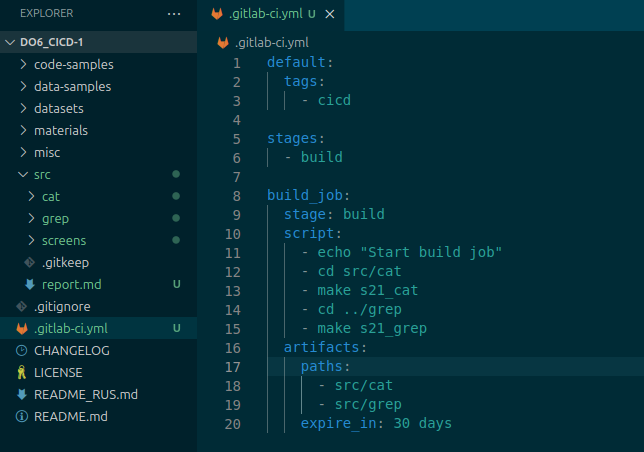

2) Запускаем на Ubuntu gitlab-runner командой `gitlab-runner run`

3) После того, как проект будет запушен, в разделе `CI/CD` -> `Pipelines` появится информация о результате:

    - Сборка прошла успешно:

        

## Part 3. Тест кодстайла

**== Задание ==**

#### Написать этап для **CI**, который запускает скрипт кодстайла (*clang-format*):

##### Если кодстайл не прошел, то "зафейлить" пайплайн

##### В пайплайне отобразить вывод утилиты *clang-format*

**== Решение ==**

1) Дополним файл `.gitlab-ci.yml` новым этапом `check-style`, в котором будут использоваться скрипты для проверки код-стайла, которые уже были в проекте:

    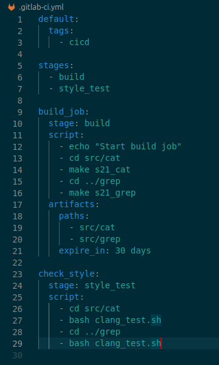

2) Результат пайплайна:

    - При нарушении кодстайла будет следующий вывод:

        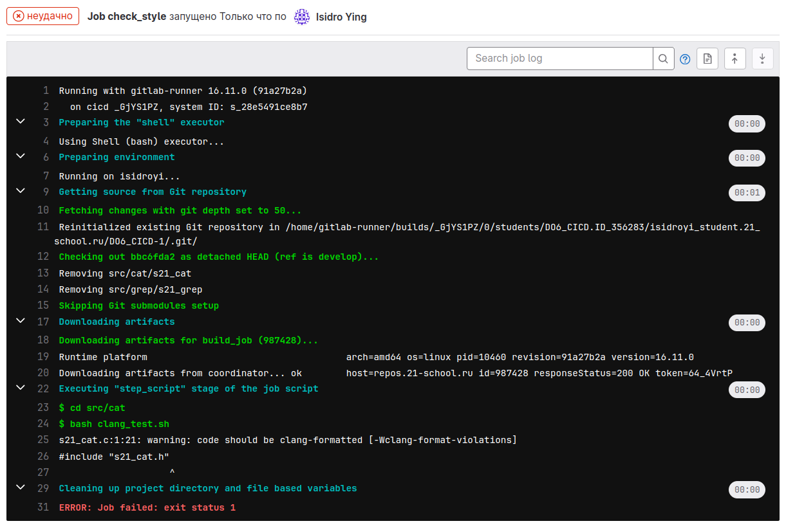

    - При соответствии кодстайлу:

        

### Part 4. Интеграционные тесты

**== Задание ==**

#### Написать этап для **CI**, который запускает ваши интеграционные тесты из того же проекта:

##### Запускать этот этап автоматически только при условии, если сборка и тест кодстайла прошли успешно

##### Если тесты не прошли, то "зафейлить" пайплайн

##### В пайплайне отобразить вывод, что интеграционные тесты успешно прошли / провалились

**== Решение ==**

1) Скрипт `src/integr_test.sh` запускает скрипты, которые были уже написаны в ходе реализации проекта, и в случае ошибки возвращает код 1.

    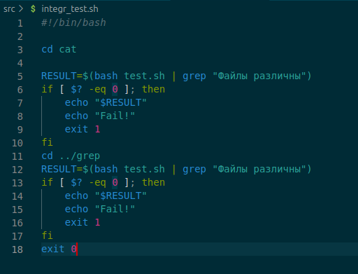

2) Дополним файл `.gitlab-ci.yml` новым этапом `integrated_tests`:

    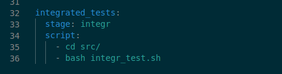

3) Результаты пайплайна:

    - При успешной проверке:

        

        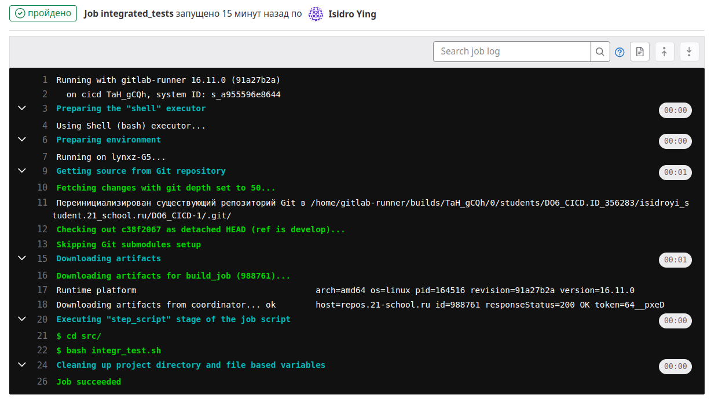

    - При провале теста:

        

        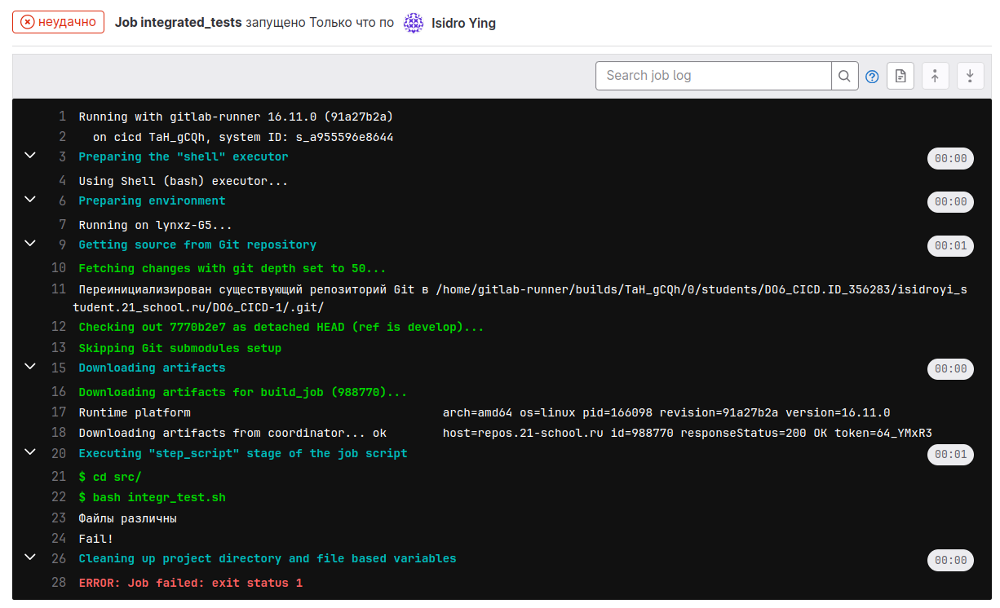

### Part 5. Этап деплоя

**== Задание ==**

##### Поднять вторую виртуальную машину *Ubuntu Server 20.04 LTS*

#### Написать этап для **CD**, который "разворачивает" проект на другой виртуальной машине:

##### Запускать этот этап вручную при условии, что все предыдущие этапы прошли успешно

##### Написать bash-скрипт, который при помощи **ssh** и **scp** копирует файлы, полученные после сборки (артефакты), в директорию */usr/local/bin* второй виртуальной машины

##### В файле _gitlab-ci.yml_ добавить этап запуска написанного скрипта

##### В случае ошибки "зафейлить" пайплайн

**== Решение ==**

1) Подготовка к выполнению задания:

    - После создания второй машины устанавливаем на ней владельцем дирректории **/usr/local/bin** пользователя *isidroyi* командой: `chown isidroyi /usr/local/bin`.

    - Устанавливаем статическое соединение между машинами командой `sudo vim /etc/netplan/00-installer-config.yaml`.

    - На машине с **gitlab-runner** переключаемся на пользователя gitlab-runner `sudo su gitlab-runner`, создаем ssh-ключ `ssh-keygen` и устанавливаем беспарольное SSH копированием открытого ключа с помощью команды `ssh-copy-id isidroyi@10.10.0.2` .

    

2) Создаем скрипт с копированием файлов через `scp`:

    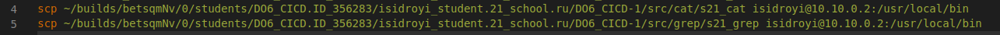

3) Добавляем новый этап в *.gitlab-ci.yml*:

    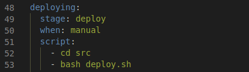

4) При успешном пайплайне этапов до делпоя в гитлабе пайплайн будет отображаться следующим образом, запускаем его вручную:

    

5) При успешном пайплайне:

    

    

6) При проваленном пайплайне работа приостановится и файлы не скопируются:

    

### Part 6. Дополнительно. Уведомления

**== Задание ==**

##### Настроить уведомления о успешном/неуспешном выполнении пайплайна через бота с именем "[ваш nickname] DO6 CI/CD" в *Telegram*

- Текст уведомления должен содержать информацию об успешности прохождения как этапа **CI**, так и этапа **CD**.
- В остальном текст уведомления может быть произвольным.

**== Решение ==**

1) Создаем бота в Телеграм с помощью [BotFather](https://t.me/BotFather):

    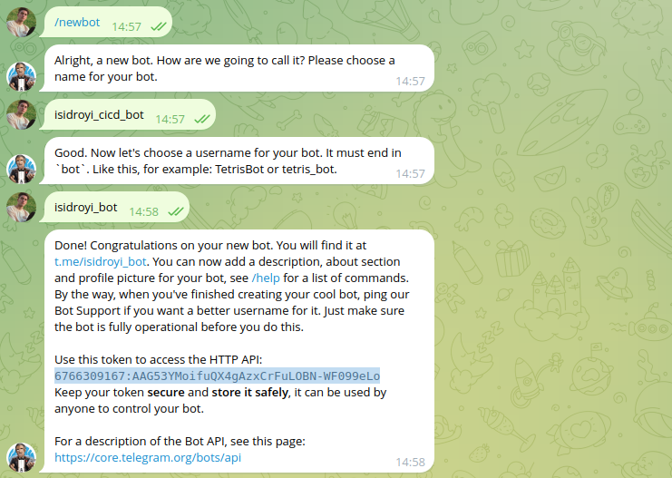

2) Далее необходимо получить id чата. Для этого пользуемся следующей командой в терминале `curl https://api.telegram.org/bot{6766309167:AAG53YMoifuQX4gAzxCrFuLOBN-WF099eLo}/getUpdates`:

    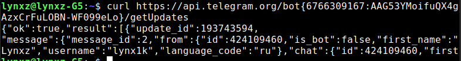

3) Создаем скрипт *notify.sh*, со следующим содержание:

    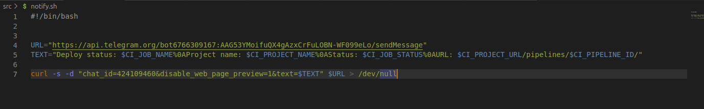

4) В *.gitlab-ci.yml* добавляем выполнение скрипта после каждого этапа. Финальный файл выглядит следующим образом:

    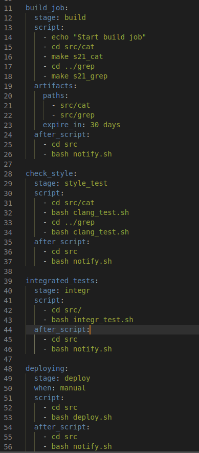

Пример сообщений:

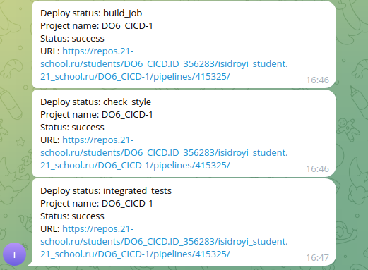