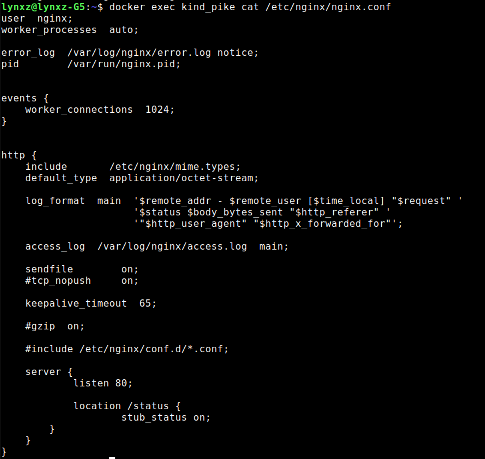

# S21_SimpleDocker

## Part 1. Готовый докер
**Docker — программное обеспечение для автоматизации развёртывания и управления приложениями в средах с поддержкой контейнеризации, контейнеризатор приложений. Позволяет «упаковать» приложение со всем его окружением[en] и зависимостями в контейнер, который может быть развёрнут на любой Linux-системе с поддержкой контрольных групп в ядре, а также предоставляет набор команд для управления этими контейнерами.**

*<https://docs.docker.com/desktop/> - по данной ссылке можно найти инструкцию по установке docker*

**nginx - это обратный прокси-сервер с открытым исходным кодом для протоколов HTTP, HTTPS и т.д.**

* Возьмемо официальный docker-образ с nginx и выкачаем его при помощи команды `docker pull`   

* Далее удостоверимся в наличии образа через команду `docker images`   

* Наконец, запустим docker-образ через команду `docker run -d [image_id|repository]`   

*-d: это флаг, который указывает Docker на запуск контейнера в фоновом режиме (detached mode). Это означает, что контейнер будет работать в фоновом режиме, и командная строка будет освобождена для дальнейшего использования.*

* Удостоверимся, что контейнер успешно запустился через команду `docker ps`   

* Теперь посмотрим информацию о контейнере через команду `docker inspect [container_id|container_name]`   

* Выведем размер контейнера    

* А теперь - список замапленных портов    

* И, наконец, IP контейнера    

* Остановим docker-образ командой `docker stop [container_id|container_name]` и проверим, что образ успешно остановился через уже знакомую команду `docker ps`   

* Теперь запустим docker-образ с портами 80:80 и 443:443 чере команду `docker run`   

* Удостоверимся, что все работает, открыв в браузере страницу по адресу `localhost`   

* Наконец, перезапустим контейнер через команду `docker restart [container_id|container_name]` и проверим, что контейнер снова запустился командой `docker ps`   

## Part 2. Операции с контейнером

* Для начала прочтем конфигурационный файл `nginx.conf` внутри docker-контейнера через команду `docker exec`   

* Теперь создадим локальный файл `nginx.conf` при помощи команды `touch nginx.conf` и настроем в нем выдачу страницы-статуса сервера по пути `/status` 

* Перенесем созданный файл внутрь docker-образа командой `docker cp`  

* Итоговый файл выглядит следующим образом:  

* И перезапустим nginx внутри docker-образа командой `docker exec [container_id|container_name] nginx -s reload`   

* Убедимся, что все работает, проверив страницу по адресу `localhost/status`   

* Теперь экспортируем наш контейнер в файл `container.tar` командой `docker export`   

* Затем удалим образ командой `docker rmi -f [image_id|repository]`, не удаляя перед этим контейнеры   

* После чего удалим остановленный контейнер командой `docker rm [container_id|container_name]`   

* Теперь импортируем контейнер обратно командой `docker import` и запустим импортированный контейнер уже знакомой командой `docker run`   

* Наконец проверим, что по адресу `localhost/status` выдается страничка со статусом сервера nginx   

## Part 3. Мини веб-сервер

* Чтобы создать свой мини веб-сервер, необходимо создать .c файл, в котором будет описана логика сервера (в нашем случае - вывод сообщения `Hello World!`), а также конфиг `nginx.conf`, который будет проксировать все запросы с порта 81 на порт 127.0.0.1:8080  
  

* Теперь выкачаем новый docker-образ и на его основе запустим новый контейнер   

* После перекинем конфиг и логику сервера в новый контейнер   

* Затем установим требуемые утилиты для запуска мини веб-сервера на FastCGI, в частности `spawn-fcgi` и `libfcgi-dev`   

* Наконец скомпилируем и запустим наш мини веб-сервер через команду `spawn-fcgi` на порту 8080   

* Чтобы удостовериться, что все работает корректно, проверим, что в браузере по адресу `localhost:81` отдается написанная нами страница   

**Если во время развертывания сервера в контейнере возникнут непредвиденные ошибки и не получится достигнуть желаемого результата, то нужно будет остановить процесс командой `kill PID`(вместо PID номер вашего процесса при развертывании сервера) и устранить ошибки в конфиге или сишной программе, после чего развернуть сервер заново**

## Part 4. Свой докер

* Напишем свой docker-образ, который собирает исходники 3-й части, запускает на порту `80`, после копирует внутрь написанный нами `nginx.conf` и, наконец, запускает `nginx` (ниже приведены файлы `run.sh` и `Dockerfile`, файлы `nginx.conf` и `server.c` остаются с 3-й части)  
  
  

* Соберем написанный docker-образ через команду `docker build`, при этом указав имя и тэг нашего контейнера    
  

* Теперь удостоверимся, что все собралось, проверив наличие соответствующего образа командой `docker images`    
  

* После запустим собранный docker-образ с мапингом порта `81` на порт `80` локальной машины, а также мапингом папки `./nginx` внутрь контейнера по адресу конфигурационных файлов nginx'а, и проверим, что страничка написанного сервера по адресу   

)

**Если при проверке адреса localhost вы увидете ошибку 502, остановите запущенный docker-образ, после исправьте ошибки в конфигурационных файлах и заново запустите собранный docker-образ**

* Теперь добавим в файл `nginx.conf` проксирование странички `/status`, по которой необходимо отдавать статус сервера `nginx    

* Теперь перезапустим `nginx` в своем docker-образе командой `nginx -s reload`    

* Наконец, проверим, что по адресу `localhost/status` выдается страничка со тсатусом сервера `nginx`    

## Part 5. **Dockle**

*<https://github.com/goodwithtech/dockle> - репозиторий с инструкцией по установке dockle*

**Dockle — инструмент для проверки безопасности образов контейнеров, который можно использовать для поиска уязвимостей. Кроме того, с его помощью можно выполнять проверку на соответствие Best Practice, чтобы убедиться, что образ действительно создаётся на основе сохраненной истории команд.**

* Просканируем docker-образ из предыдущего задания на предмет наличия ошибок командой `dockle [image_id|repository]`    

* Далее исправим конфигурационные файлы docker-образа так, чтобы при проверке через утилиту `dockle` не возникало ошибок и предупреждений     

## Part 6. Базовый **Docker Compose**

**Docker Compose — это инструментальное средство, входящее в состав Docker. Оно предназначено для решения задач, связанных с развёртыванием проектов.**

### Разница между Docker и Docker Compose

**Docker применяется для управления отдельными контейнерами (сервисами), из которых состоит приложение.**

**Docker Compose используется для одновременного управления несколькими контейнерами, входящими в состав приложения. Этот инструмент предлагает те же возможности, что и Docker, но позволяет работать с более сложными приложениями.**

*<https://www.digitalocean.com/community/tutorials/how-to-install-and-use-docker-compose-on-ubuntu-20-04> - инструкция по устанвке (При установке обратите внимание, на то какая версия актуальна в данный момент)*

* Изменим конфигурационные файлы (их можно найти в папке `src/part_6`)

* Теперь сбилдим контейнер командой `docker-compose build`  
  

* После необходимо поднять сбилженный контейнер командой `docker compose up`  
  

* В завершение удостоверимся, что по адресу `localhost` отдается страничка с надписью `Hello World!`  

  
