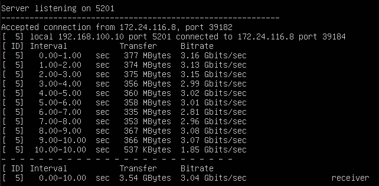
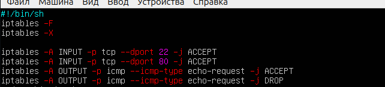
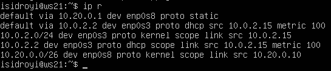

## Part 1. Инструмент ipcalc

**ipcalc** — это утилита, которая может выполнять простые манипуляции с адресами IPv4.
Если вы просто наберете ` ipcalc ` без каких-либо параметров ввода, это даст хороший вывод «справки» с некоторыми примерами, которые очень полезны для начала работы.

Инструмент ` ipcalc ` можно применять для следующих задач:
- проверить IP-адрес;
- показать рассчитанный широковещательный адрес;
- отображение имени хоста, определенного через DNS;
- отображение сетевого адреса или префикса.

Для установки утилиты ` ipcalc ` следует ввести следующую команду:

 ` sudo apt install ipcalc `


* ### 1.1. Сети и маски
    * Адрес сети 192.167.38.54/13 - 192.160.0.0
    * Перевод маски 255.255.255.0:
        * в префиксную: /24
        * двоичную запись: 11111111.11111111.11111111.00000000 
    * /15:
        * в обычную: 255.254.0.0
        * двоичную: 11111111.11111110.00000000.00000000
    * 11111111.11111111.11111111.11110000:
        * в обычную: 255.255.255.240
        * префиксную: /28
    
    * Минимальный и максимальный хост в сети 12.167.38.4 при масках: 
        * /8 - 12.0.0.1 и 12.255.255.254
        * 11111111.11111111.00000000.00000000 - 12.167.0.1 и 12.167.255.254
        * 255.255.254.0 - 12.167.38.1 и 12.167.39.254
        * /4 - 0.0.0.1 и 15.255.255.254

* ### 1.2. localhost

    * Определить и записать в отчёт, можно ли обратиться к приложению, работающему на localhost, со следующими IP: 
        * 194.34.23.100 - NO
        * 127.0.0.2 - localhost
        * 127.1.0.1 - localhost
        * 128.0.0.1 - NO


* ### 1.3. Диапазоны и сегменты сетей
    * Какие из перечисленных IP можно использовать в качестве публичного, а какие только в качестве частных: 
        * 10.0.0.45 - private
        * 134.43.0.2 - public
        * 192.168.4.2 - private
        * 172.20.250.4 - private
        * 172.0.2.1 - public
        * 192.172.0.1 - public 
        * 172.68.0.2 - public
        * 172.16.255.255 - private 
        * 10.10.10.10 - private
        * 192.169.168.1 - public

    * Какие из перечисленных IP адресов шлюза возможны у сети 10.10.0.0/18: 
        * Для сети 10.10.0.0/18 возможные шлюзы должны находиться в пределах этой сети. Для сети 10.10.0.0/18 диапазон IP адресов будет от 10.10.0.1 до 10.10.63.254.

        * Таким образом, возможные шлюзы для сети 10.10.0.0/18: 10.10.0.2, 10.10.10.10, 10.10.1.255.

## Part 2. Статическая маршрутизация между двумя машинами

###  Поднимаем две виртуальные машины  ws1 и ws2.

С помощью команды ` ip a ` посмотреть существующие сетевые интерфейсы:


* Описать сетевой интерфейс, соответствующий внутренней сети, на обеих машинах и задать следующие адреса и маски: ws1 - 192.168.100.10, маска /16, ws2 - 172.24.116.8, маска /12

В отчёт поместить скрины с содержанием изменённого файла etc/netplan/00-installer-config.yaml для каждой машины.


* Выполнить команду netplan apply для перезапуска сервиса сети. В отчёт поместить скрин с вызовом и выводом использованной команды.


### 2.1. Добавление статического маршрута вручную
Добавить статический маршрут от одной машины до другой и обратно при помощи команд ` sudo ip route add 172.24.116.8 dev enp0s3 `  и  ` sudo ip route add 192.168.100.0 dev enp0s3 ` для ws1 и ws2 соответственно.
Пропинговать соединение между машинами:

 


### 2.2. Добавление статического маршрута с сохранением

Перезапустить машины. Добавить статический маршрут от одной машины до другой с помощью файла etc/netplan/00-installer-config.yaml
В отчёт поместить скрин с содержанием изменённого файла etc/netplan/00-installer-config.yaml:

>`sudo vim /etc/netplan/00-installer-config.yaml` 


 

`sudo netplan apply`

Пропинговать соединение между машинами. В отчёт поместить скрин с вызовом и выводом использованной команды:


## Part 3. Утилита iperf3

### 3.1. Скорость соединения

Базовой единицей скорости передачи информации является бит в секунду (бит/с).
Разница между байтами в секунду (Б/с) и битами в секунду (бит/c) такая же, как разница между байтами (Б) и битами (бит): 1 Б/с = 8 бит/с.
Точно так же разница между килобайтами в секунду (КБ/с) и Б/с такая же, как разница между килобайтами и байтами: 1 КБ/с = 1024 Б/с. И так далее. 

Перевести и записать в отчёт:

* 8 Mbps (мегабит в секуду) = 1 MB/s (мегабайт в секунду)

* 100 MB/s (мегабайт в секунду) = 800 000 Kbps (килобит в секунду)

* 1 Gbps (гигабит в секунду) = 1 000 Mbps (мегабит в секунду)

### 3.2. Утилита iperf3

**iperf3** — кроссплатформенная консольная клиент-серверная программа — генератор TCP и UDP трафика для тестирования пропускной способности в IP-сетях (поддерживает IPv4 и IPv6). С ее помощью довольно просто измерить максимальную пропускную способность сети между сервером и клиентом и провести нагрузочное тестирование канала связи.
Поскольку утилита имеет как серверную часть так и клиентскую, надо рассматривать обе отдельно. 
Чтобы протестировать пропускную способность сети, вам нужно сначала подключиться к удаленной машине, которую вы будете использовать в качестве сервера. Для запуска сервера (по умолчанию он будет прослушивать порт 5201) используется синтаксис:

> ` iperf3 -s [опции] `

> ` iperf3 -s -f K `

- ` -f ` - формат в котором выводить информацию (k - кбит, m - мегабит, g - гигабит или K - килобайт, M - мегабайт, G - гигабайт);


Затем на локальном компьютере, который рассматривается как клиент, нужно запустить **iperf3** в клиентском режиме, используя флаг *-c*, и указать хост, на котором работает сервер (используя либо его IP-адрес, либо домен, либо имя хоста).

> ` iperf3 -c [адрес_сервера] [опции] `

> ` iperf3 -c 192.168.10.1 -f K `

#### Измерим скорость соединения между ws1 и ws2 с помощью утилиты iperf3

Установка утилиты ` iperf3 ` осуществляется с помощью команды

> ` sudo apt install iperf3 `


Запускаем утилиту на ` ws1 ` в режиме сервер с флагом ` -s `. Она будет ожидать пока не запустится этаже утилита на ` ws2 ` в режиме клиента.

> ` iperf3 -s ` 



Следом запускаем на ` ws2 ` утилиту в режиме клиент с флагом ` -c ` и указываем IP-адрес ` ws1 `.

> ` iperf3 -c 192.168.100.10 ` 


## Part 4. Сетевой экран

Сетевой или межсетевой экран – это комплекс программных или аппаратных средств, которые позволяют осуществлять фильтрацию и контроль проходящих через него пакетов в соответствии с заданными заранее параметрами.
Основная задача межсетевого экрана – это защита компьютерных сетей или конкретных узлов от доступа злоумышленников. Межсетевые экраны часто называют фильтрами, что связанно с их основной задачей – фильтровать пакеты, которые не подходят под критерии, определенные в конфигурации.

### 4.1. Утилита iptables

**iptables** — это утилита брандмауэра командной строки, которая использует цепочки политик для разрешения или блокировки трафика. Когда соединение пытается установиться в системе, ` iptables ` ищет правило в своем списке, чтобы сопоставить его. Если утилита не находит нужного правила, она прибегает к действию по умолчанию.

Подсистема ` iptables ` и `Netfilter` уже достаточно давно встроена в ядро Linux. Все сетевые пакеты, которые проходят через компьютер, отправляются компьютером или предназначены компьютеру, ядро направляет через фильтр ` iptables `. Там эти пакеты поддаются проверкам и затем для каждой проверки, если она пройдена выполняется указанное в ней действие. Например, пакет передается дальше ядру для отправки целевой программе, или отбрасывается.

* В отчёт поместить скрины с содержанием файла /etc/firewall для каждой машины.




* В отчёт поместить скрины с запуском обоих файлов. 


* В отчёте описать разницу между стратегиями, применёнными в первом и втором файлах:

Действия для таблицы FILTER являются терминальными, т.е. прекращают прохождение пакета по цепочке.
В первом случае сработает правило DROP и дальше пакет не пойдет, во втором наоборот.


### 4.2. Утилита nmap

**nmap** - это очень популярный сканер сети, для исследования сети и аудита безопасности. Он имеет открытый исходный код, который может использоваться как в Windows, так и в Linux.

Эта программа помогает системным администраторам очень быстро понять какие компьютеры подключены к сети, узнать их имена, а также посмотреть какое программное обеспечение на них установлено, какая операционная система и какие типы фильтров применяются. 

Командой ping найти машину, которая не "пингуется", после чего утилитой nmap показать, что хост машины запущен:


Запускаем утилиту ` nmap `


Видим в выводе `host up`

## Part 5. Статическая маршрутизация сети

####  Поднимаем пять виртуальных машин (3 рабочие станции (ws11, ws21, ws22) и 2 роутера (r1, r2)).

Сначала создаём одну виртуальную машину. Потом нажимаем правую клавишу мыши на вновь созданной машине, вибираем *Клонировать...* и клонируем ещё 4 машины с соответствующими заданию именами (` ws11 `, ` ws21 `, ` ws22 ` и ` r1 `, ` r2 `).

* Настроим конфигурации машин в etc/netplan/00-installer-config.yaml согласно сети на рисунке.

>`sudo vim /etc/netplan/00-installer-config.yaml`


Перезапускаем сервисы сети.

> ` sudo netplan apply `

Проверим, что адрес машины задан верно. 

> ` ip -4 a `


Пропингуем ` ws22 ` с ` ws21 ` с помощью команды 

> ` ping -c 5 10.20.0.10 `
 


Аналогично пингуем ` r1 ` с ` ws11 ` 

> ` ping -c 5 10.10.0.2 `


### 5.2. Включение переадресации IP-адресов.

Для включения переадресации IP, выполняем команду на роутерах 

> ` sudo sysctl -w net.ipv4.ip_forward=1 `

Однако при таком подходе переадресация не будет работать после перезагрузки системы.


Откроем файл ` /etc/sysctl.conf ` 

> ` sudo vim /etc/sysctl.conf `

Раскомментируем строку `` net.ipv4.ip_forward = 1 `` и сохраним изменения. Теперь IP-переадресация включена на постоянной основе.


### 5.3. Установка маршрута по-умолчанию

* Настроить маршрут по-умолчанию (шлюз) для рабочих станций. Для этого добавить default перед IP роутера в файле конфигураций.
В отчёт поместить скрин с содержанием файла etc/netplan/00-installer-config.yaml:

>`sudo vim /etc/netplan/00-installer-config.yaml`


* Вызвать ip r и показать, что добавился маршрут в таблицу маршрутизации.
В отчёт поместить скрин с вызовом и выводом использованной команды:

_ws11:_


_ws21:_


_ws22:_


* Пропинговать с ws11 роутер r2 и показать на r2, что пинг доходит. Для этого использовать команду:
__tcpdump -tn -i eth1__
В отчёт поместить скрин с вызовом и выводом использованных команд.


* ping


* tcpdump

### 5.4. Добавление статических маршрутов

* Добавить в роутеры r1 и r2 статические маршруты в файле конфигураций. В отчёт поместить скрины с содержанием изменённого файла etc/netplan/00-installer-config.yaml для каждого роутера:

_r1:_


_r2:_


Вызвать `ip r` и показать таблицы с маршрутами на обоих роутерах. В отчёт поместить скрин с вызовом и выводом использованной команды:

_r1:_


_r2:_


Запустить команды на ws11:
ip r list 10.10.0.0/[маска сети] и ip r list 0.0.0.0/0
В отчёт поместить скрин с вызовом и выводом использованных команд:


В отчёте объяснить, почему для адреса 10.10.0.0/[маска сети] был выбран маршрут, отличный от 0.0.0.0/0, хотя он попадает под маршрут по-умолчанию.

Для локальной подсети 10.10.0.0/18 у нас отдельный маршрут, чтобы пакеты не отправлялись на все остальные адреса, входящие в 0.0.0.0/0

### 5.5. Построение списка маршрутизаторов

Запустить на r1 команду дампа:
```tcpdump -tnv -i eth0```


* При помощи утилиты traceroute построить список маршрутизаторов на пути от ws11 до ws21:


* В отчёт поместить скрины с вызовом и выводом использованных команд (tcpdump и traceroute). В отчёте, опираясь на вывод, полученный из дампа на r1, объяснить принцип работы построения пути при помощи traceroute:

_Чтобы доставить пакет от ws11 (IP 10.10.0.2) до ws21(IP 10.20.0.10, он пройдет через шлюз 10.0.0.1 и там свяжется со шлюзом 10.100.0.12 и через него попадет в нужную подсеть 10.20.0.0/26. На tcpdump видно, как ПК связывается с роутером, который является шлюзом по умолчанию, и с помощью ARP запроса они  узнают кому принадлежит нужный IP адрес._

### 5.6. Использование протокола ICMP при маршрутизации

* Запустить на r1 перехват сетевого трафика, проходящего через eth0 с помощью команды:
```tcpdump -n -i eth0 icmp```
* Пропинговать с ws11 несуществующий IP (например, 10.30.0.111) с помощью команды:
```ping -c 5 10.30.0.111```

   В отчёт поместить скрин с вызовом и выводом использованных команд:


## Part 6. Динамическая настройка IP с помощью DHCP

### 6.1 Настройка службы DHCP на r2

Если утилита ` isc-dhcp-server ` ещё не установлена, то файла ` /etc/dhcp/dhcpd.conf ` ещё не существует в нужном виде. Соотвтетственно для работы с протоколом **DHCP** сначала надо установить эту утилиту

> ` sudo apt-get install isc-dhcp-server `

Теперь для **r2** можем настроить в файле ` /etc/dhcp/dhcpd.conf ` конфигурацию службы  ` DHCP `

1) указываем адрес маршрутизатора по-умолчанию, DNS-сервер и адрес внутренней сети.

Открываем файл ` /etc/dhcp/dhcpd.conf ` для редактирования

> ` sudo vim /etc/dhcp/dhcpd.conf `

Вносим изменения


2) в файле ` /etc/resolv.conf `(содержит адреса серверов имен, к которым имеет доступ данная система) прописываем ` nameserver 8.8.8.8 `

> ` sudo vim /etc/resolv.conf `


* Перезагрузить службу DHCP командой systemctl restart isc-dhcp-server. Машину ws21 перезагрузить при помощи reboot и через ip a показать, что она получила адрес. Также пропинговать ws22 с ws21.

__r2:__


__ws21:__


__ping ws21-ws22:__


* Указать MAC адрес у ws11, для этого в etc/netplan/00-installer-config.yaml надо добавить строки: macaddress: 10:10:10:10:10:BA, dhcp4: true. В отчёт поместить скрин с содержанием изменённого файла etc/netplan/00-installer-config.yaml:


* Для r1 настроить аналогично r2, но сделать выдачу адресов с жесткой привязкой к MAC-адресу (ws11). Провести аналогичные тесты. В отчёте этот пункт описать аналогично настройке для r2:

Для **r1** настроим аналогично **r2**, но выдачу адресов сделаем с жесткой привязкой к MAC-адресу (**ws11**).

> ` sudo apt-get install isc-dhcp-server `

> ` sudo vim /etc/dhcp/dhcpd.conf `


> ` sudo vim /etc/resolv.conf `


> ` systemctl restart isc-dhcp-server `


> ` sudo systemctl status isc-dhcp-server `


Проводим аналогичные тесты - смотрим какой адрес назначен машине **ws11**

> ` ip a `


Пропингуем соединение

> ` ping -c 5 10.10.0.4 `


### 6.3 Обновление ip адреса с помощью команды *sudo dhclient*.

* Запросить с ws21 обновление ip адреса. В отчёте поместить скрины ip до и после обновления:

`ip a`


`dhclient -r`


`dhclient`


В отчёте описать, какими опциями DHCP сервера пользовались в данном пункте:

Сначала мы через команду ```dhclient -r``` освобождаем выданный нам IP, а потом запрашиваем новый через команду ```dhclient```.


## Part 7. NAT
* В файле ```/etc/apache2/ports.conf``` на ws22 и r1 изменить строку Listen 80 на Listen 0.0.0.0:80, то есть сделать сервер Apache2 общедоступным

__r1:__


__ws22:__


* Запустить веб-сервер Apache командой ```service apache2 start``` на ws22 и r1. В отчёт поместить скрины с вызовом и выводом использованной команды:

__r1:__


__ws22:__


* Добавить в фаервол, созданный по аналогии с фаерволом из Части 4, на r2 следующие правила:


* Проверить соединение между ws22 и r1 командой ping. При запуске файла с этими правилами, ws22 не должна "пинговаться" с r1.
В отчёт поместить скрины с вызовом и выводом использованной команды:


* Добавить в файл ещё одно правило:
Разрешить маршрутизацию всех пакетов протокола ICMP.
Запускать файл также, как в Части 4. Проверить соединение между ws22 и r1 командой ping. При запуске файла с этими правилами, ws22 должна "пинговаться" с r1.
В отчёт поместить скрины с вызовом и выводом использованной команды:


* Включить SNAT, а именно маскирование всех локальных ip из локальной сети, находящейся за r2 (по обозначениям из Части 5 - сеть 10.20.0.0)

* Включить DNAT на 8080 порт машины r2 и добавить к веб-серверу Apache, запущенному на ws22, доступ извне сети. В отчёт поместить скрин с содержанием изменённого файла:


![ping]

* Проверить соединение по TCP для SNAT, для этого с ws22 подключиться к серверу Apache на r1 командой: ```telnet [адрес] [порт]```


> ` telnet 10.100.0.11 80 `

* Проверить соединение по TCP для DNAT, для этого с r1 подключиться к серверу Apache на ws22 командой telnet (обращаться по адресу r2 и порту 8080):

> ` telnet 10.100.0.12 8080 `


## Part 8. Дополнительно. Знакомство с SSH Tunnels

* Запустить веб-сервер Apache на ws22 только на localhost (то есть в файле /etc/apache2/ports.conf изменить строку Listen 80 на Listen localhost:80):


* Воспользоваться Local TCP forwarding с ws21 до ws22, чтобы получить доступ к веб-серверу на ws22 с ws21:


Проверяем соединение через telnet:


* Воспользоваться Remote TCP forwarding c ws11 до ws22, чтобы получить доступ к веб-серверу на ws22 с ws11:


Проверяем соединение через telnet:


